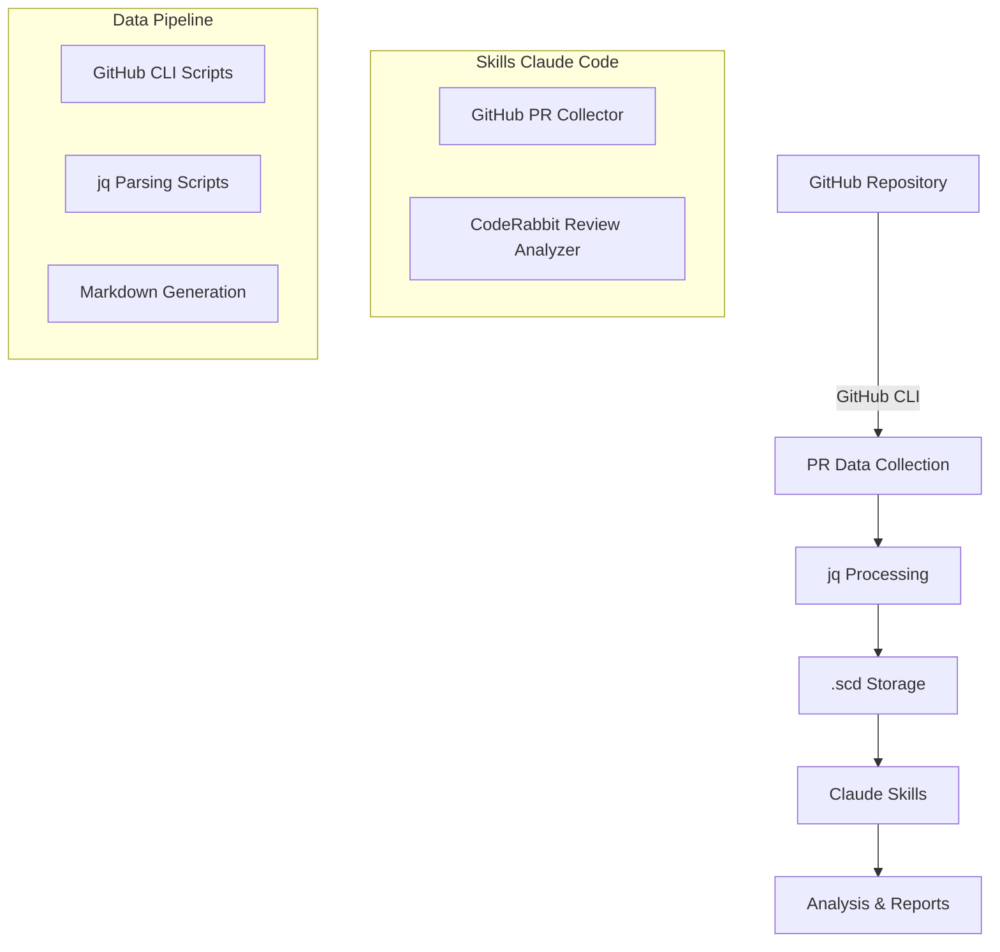

# **Guide Complet : Créer des Skills Claude Code Basés sur Bash pour l'Analyse des Pull Requests GitHub avec CodeRabbit**

## **Table des Matières**

1. [Introduction et Vision du Projet](#introduction-et-vision-du-projet)
2. [Architecture Globale du Système](#architecture-globale-du-système)
3. [Prérequis et Installation](#prérequis-et-installation)
4. [Structure des Skills Claude Code](#structure-des-skills-claude-code)
5. [Skill 1: GitHub PR Collector](#skill-1-github-pr-collector)
6. [Skill 2: CodeRabbit Review Analyzer](#skill-2-coderabbit-review-analyzer)
7. [Scripts Bash Sécurisés](#scripts-bash-sécurisés)
8. [Installation et Déploiement](#installation-et-déploiement)
9. [Utilisation et Workflows](#utilisation-et-workflows)
10. [Maintenance et Évolution](#maintenance-et-évolution)

---

## **Introduction et Vision du Projet**

### **Contexte et Objectifs**

Dans l'écosystème moderne de développement logiciel, les Pull Requests constituent le point névralgique de la collaboration et de la qualité du code. Les outils d'IA comme **CodeRabbit** enrichissent considérablement ce processus en fournissant des analyses automatisées sophistiquées, mais l'exploitation optimale de ces données nécessite une orchestration intelligente.

Ce guide présente une approche innovante combinant :
- **Les Skills Claude Code** pour encapsuler l'expertise d'analyse
- **Des scripts Bash sécurisés** pour économiser les tokens et optimiser les performances
- **GitHub CLI** pour une intégration native avec l'écosystème GitHub
- **L'extraction jq** pour un parsing précis des métadonnées CodeRabbit

### **Philosophie : Bash-First avec Intelligence IA**

L'approche proposée suit le principe **"Bash-First, IA-Smart"** :
- Les tâches déterministes (récupération de données, parsing, filtrage) sont déléguées à Bash
- L'intelligence artificielle se concentre sur l'analyse, la synthèse et la génération de insights
- Cette répartition optimise l'utilisation des tokens tout en maximisant la fiabilité

---

## **Architecture Globale du Système**

### **Vue d'Ensemble des Composants**



### **Flux de Données**

1. **Collection** : GitHub CLI récupère les données des PR en cours
2. **Extraction** : jq parse les commentaires CodeRabbit et extrait les métadonnées
3. **Classification** : Les commentaires sont triés par type et importance
4. **Stockage** : Génération de fichiers Markdown structurés dans `.scd/`
5. **Analyse** : Claude Code utilise les données préprocessées pour l'analyse avancée

### **Structure du Projet Utilisateur**

```
your-project/                      # Projet de l'utilisateur
├── .claude/                       # Skills Claude Code (installés localement)
│   └── skills/
│       ├── github-pr-collector/
│       └── review-analyzer/
├── .scd/                          # Données des analyses (dans le projet)
│   ├── pr-data/                   # Données des Pull Requests
│   │   ├── pr-{number}/           # Dossier par PR
│   │   │   ├── 🔴-critical/       # Commentaires critiques
│   │   │   │   ├── comment-{id}.md
│   │   │   │   └── comment-{id}.md
│   │   │   ├── 🟠-major/          # Commentaires majeurs
│   │   │   ├── 🟡-minor/          # Commentaires mineurs
│   │   │   ├── 🔵-trivial/        # Commentaires triviaux
│   │   │   └── summary.md         # Résumé de la PR
│   │   └── global-summary.md      # Résumé global
│   ├── config/                    # Configuration des agents
│   │   ├── agents-patterns.json   # Patterns pour tous les agents
│   │   └── severity-mapping.json  # Mapping de sévérité
│   └── cache/                     # Cache temporaire
└── your-code/                     # Code du projet utilisateur
    ├── src/
    └── README.md
```

---

## **Prérequis et Installation**

### **Dépendances Système**

```bash
# Outils requis
- GitHub CLI (gh) >= 2.0.0
- jq >= 1.6
- curl
- bash >= 4.0
```

### **Configuration GitHub CLI**

```bash
# Authentification GitHub CLI (une fois)
gh auth login

# Vérification des permissions
gh auth status

# Test de base
gh pr list --repo $(gh repo view --json nameWithOwner -q .nameWithOwner)
```

### **Variables d'Environnement**

```bash
# Variables automatiquement détectées dans le projet courant
CC_SKILLS_PROJECT_ROOT="$(git rev-parse --show-toplevel 2>/dev/null || pwd)"
CC_SKILLS_DATA_DIR="${CC_SKILLS_PROJECT_ROOT}/.scd"
CC_SKILLS_CONFIG_DIR="${CC_SKILLS_DATA_DIR}/config"
```

---

## **Structure des Skills Claude Code**

### **Skill 1: GitHub PR Collector**

#### **SKILL.md - GitHub PR Collector**

```yaml
---
name: "github-pr-collector"
description: "Collecte et analyse les Pull Requests GitHub avec leurs commentaires d'agents de review IA (CodeRabbit, GitHub Copilot, Codex, etc.). Utilise GitHub CLI pour récupérer les données, extrait les métadonnées des agents avec jq, et génère une structure organisée par PR et par importance dans le dossier .scd du projet. Extensible pour supporter de nouveaux agents de review."
version: "1.0.0"
dependencies:
  - "github-cli >= 2.0.0"
  - "jq >= 1.6"
---

# GitHub PR Collector Skill

## Objectif

Ce skill automatise la collecte et l'extraction des données des Pull Requests GitHub, avec support pour multiple agents de review IA (CodeRabbit, GitHub Copilot, Codex, et autres). Il optimise l'utilisation des tokens en préprocessant les données via des scripts Bash et organise les commentaires par PR et par niveau d'importance.

## Processus

### 1. Collecte des Données

Le skill utilise le script `collect-pr-data.sh` pour :
- Identifier le repository courant via `gh repo view`
- Récupérer la liste des PR en cours avec `gh pr list`
- Pour chaque PR, extraire les métadonnées complètes
- Télécharger tous les commentaires de review

### 2. Extraction des Métadonnées des Agents IA

Via `parse-review-agents.sh`, le skill :
- Identifie les commentaires provenant des agents IA (CodeRabbit, Copilot, Codex, etc.)
- Extrait les métadonnées de classification (⚠️ Potential issue, 🟠 Major, etc.)
- Classe les commentaires par agent, type et importance
- Crée une structure organisée : PR > Importance > Commentaire individuel
- Architecture extensible pour supporter de nouveaux agents

### 3. Génération de Résumés

Le script `generate-summary.sh` produit :
- Validation de chaque étape du processus avec indicateurs visuels
- Statistiques concises par PR et globales
- Fichier `summary.md` par PR avec métriques essentielles
- Rapport global `global-summary.md` avec vue d'ensemble

## Utilisation

### Déclencheurs Typiques
- "Analyse les PR en cours de ce repository"
- "Que dit CodeRabbit sur les dernières PR ?"
- "Donne-moi un résumé des reviews des PR ouvertes"
- "Quels sont les problèmes identifiés par CodeRabbit ?"

### Sortie

Les données sont stockées dans `.scd/github-pr-collector/data/pr-data/` et un résumé est affiché à l'utilisateur avec :
- Nombre de PR analysées
- Distribution des commentaires par sévérité
- Statistiques par PR
- Lien vers les fichiers détaillés générés

## Gestion des Erreurs

Le skill gère gracieusement :
- L'absence de GitHub CLI ou d'authentification
- Les repositories sans PR
- Les PR sans commentaires CodeRabbit
- Les limites de taux de l'API GitHub

## Référence

Les scripts utilisent les ressources suivantes :
- `scripts/collect-pr-data.sh` - Collection GitHub CLI
- `scripts/parse-coderabbit.sh` - Parsing jq des métadonnées
- `scripts/generate-summary.sh` - Génération Markdown
```

#### **Script collect-pr-data.sh**

```bash
#!/bin/bash
set -euo pipefail

# Script de collecte des données GitHub PR avec gestion CodeRabbit
# Auteur: scd-cc
# Version: 1.0.0

# Configuration et variables globales
readonly SCRIPT_DIR="$(cd "$(dirname "${BASH_SOURCE[0]}")" && pwd)"
readonly PROJECT_ROOT="$(git rev-parse --show-toplevel 2>/dev/null || pwd)"
readonly DATA_DIR="${PROJECT_ROOT}/.scd"
readonly PR_DATA_DIR="${DATA_DIR}/pr-data"
readonly CONFIG_DIR="${DATA_DIR}/config"
readonly CACHE_DIR="${DATA_DIR}/cache"
readonly LOG_FILE="${DATA_DIR}/collect-pr.log"

# Couleurs pour l'affichage
readonly RED='\033[0;31m'
readonly GREEN='\033[0;32m'
readonly YELLOW='\033[1;33m'
readonly BLUE='\033[0;34m'
readonly NC='\033[0m' # No Color

# Fonction de logging
log() {
    local level="$1"
    shift
    echo "[$(date +'%Y-%m-%d %H:%M:%S')] [$level] $*" | tee -a "$LOG_FILE"
}

# Fonction de nettoyage
cleanup() {
    local exit_code=$?
    if [[ -d "$CACHE_DIR" ]]; then
        rm -rf "${CACHE_DIR:?}"/*
    fi
    exit $exit_code
}

# Configuration du trap pour le nettoyage
trap cleanup EXIT INT TERM

# Vérification des prérequis
check_prerequisites() {
    log "INFO" "Vérification des prérequis..."
    
    if ! command -v gh >/dev/null 2>&1; then
        log "ERROR" "GitHub CLI (gh) n'est pas installé"
        return 1
    fi
    
    if ! command -v jq >/dev/null 2>&1; then
        log "ERROR" "jq n'est pas installé"
        return 1
    fi
    
    # Vérification de l'authentification GitHub
    if ! gh auth status >/dev/null 2>&1; then
        log "ERROR" "Non authentifié avec GitHub CLI. Exécutez: gh auth login"
        return 1
    fi
    
    log "INFO" "Prérequis validés ✓"
    return 0
}

# Création de la structure de dossiers
setup_directories() {
    log "INFO" "Configuration des répertoires..."
    
    mkdir -p "$PR_DATA_DIR" "$CACHE_DIR"
    
    # Permissions sécurisées
    chmod 750 "$DATA_DIR" "$PR_DATA_DIR" "$CACHE_DIR"
    
    log "INFO" "Structure créée: $PR_DATA_DIR"
}

# Récupération des informations du repository
get_repo_info() {
    log "INFO" "Récupération des informations du repository..."
    
    local repo_info
    if ! repo_info=$(gh repo view --json nameWithOwner,defaultBranchRef 2>/dev/null); then
        log "ERROR" "Impossible de récupérer les informations du repository"
        return 1
    fi
    
    echo "$repo_info" | jq -r '.nameWithOwner'
}

# Collecte des Pull Requests
collect_pull_requests() {
    local repo_name="$1"
    local pr_state="${2:-open}"
    
    log "INFO" "Collecte des PR ($pr_state) pour $repo_name..."
    
    local pr_list_file="${CACHE_DIR}/pr-list.json"
    
    # Récupération de la liste des PR avec toutes les métadonnées nécessaires
    if ! gh pr list \
        --repo "$repo_name" \
        --state "$pr_state" \
        --json number,title,author,createdAt,updatedAt,url,headRefName,baseRefName,draft,mergeable \
        --limit 50 > "$pr_list_file"; then
        log "ERROR" "Échec de la récupération des PR"
        return 1
    fi
    
    local pr_count
    pr_count=$(jq 'length' "$pr_list_file")
    
    if [[ "$pr_count" -eq 0 ]]; then
        log "WARN" "Aucune PR trouvée dans l'état: $pr_state"
        return 0
    fi
    
    log "INFO" "Trouvé $pr_count PR(s) à analyser"
    
    # Traitement de chaque PR
    local pr_number
    while IFS= read -r pr_number; do
        if [[ -n "$pr_number" ]] && [[ "$pr_number" != "null" ]]; then
            process_pull_request "$repo_name" "$pr_number"
        fi
    done < <(jq -r '.[].number' "$pr_list_file")
    
    return 0
}

# Traitement d'une Pull Request individuelle
process_pull_request() {
    local repo_name="$1"
    local pr_number="$2"
    
    log "INFO" "Traitement de la PR #$pr_number..."
    
    local pr_data_file="${CACHE_DIR}/pr-${pr_number}-data.json"
    local pr_reviews_file="${CACHE_DIR}/pr-${pr_number}-reviews.json"
    
    # Récupération des données détaillées de la PR
    if ! gh pr view "$pr_number" \
        --repo "$repo_name" \
        --json number,title,body,author,createdAt,updatedAt,url,headRefName,baseRefName,draft,mergeable,labels,assignees,reviewRequests,milestone,projectCards \
        > "$pr_data_file"; then
        log "WARN" "Échec de la récupération des données pour PR #$pr_number"
        return 1
    fi
    
    # Récupération des reviews et commentaires
    if ! gh api "repos/$repo_name/pulls/$pr_number/reviews" \
        --paginate \
        --jq '.[] | select(.body != null and .body != "")' \
        > "$pr_reviews_file"; then
        log "WARN" "Échec de la récupération des reviews pour PR #$pr_number"
        # Continuer même sans reviews
        echo "[]" > "$pr_reviews_file"
    fi
    
    # Récupération des commentaires de review (commentaires sur les lignes de code)
    local pr_review_comments_file="${CACHE_DIR}/pr-${pr_number}-review-comments.json"
    if ! gh api "repos/$repo_name/pulls/$pr_number/comments" \
        --paginate \
        > "$pr_review_comments_file"; then
        log "WARN" "Échec de la récupération des commentaires de review pour PR #$pr_number"
        echo "[]" > "$pr_review_comments_file"
    fi
    
    # Appel du script de parsing des agents de review
    if ! "$SCRIPT_DIR/parse-review-agents.sh" "$pr_number" "$pr_data_file" "$pr_reviews_file" "$pr_review_comments_file"; then
        log "ERROR" "Échec du parsing des agents de review pour PR #$pr_number"
        return 1
    fi
    
    log "INFO" "PR #$pr_number traitée avec succès ✓"
    return 0
}

# Génération du rapport global
generate_global_report() {
    log "INFO" "Génération du rapport global..."
    
    local report_file="${PR_DATA_DIR}/pr-analysis-report.md"
    local timestamp=$(date '+%Y-%m-%d %H:%M:%S')
    
    cat > "$report_file" << EOF
# Rapport d'Analyse des Pull Requests

**Généré le :** $timestamp
**Repository :** $(get_repo_info)

## Résumé

EOF
    
    # Comptage des fichiers générés
    local pr_count=0
    for file in "$PR_DATA_DIR"/pr-*-summary.md; do
        [[ -f "$file" ]] && ((pr_count++))
    done
    
    echo "- **Pull Requests analysées :** $pr_count" >> "$report_file"
    echo "- **Données stockées dans :** \`.scd/github-pr-collector/data/pr-data/\`" >> "$report_file"
    echo "" >> "$report_file"
    
    if [[ $pr_count -gt 0 ]]; then
        echo "## Liste des Pull Requests" >> "$report_file"
        echo "" >> "$report_file"
        
        for file in "$PR_DATA_DIR"/pr-*-summary.md; do
            if [[ -f "$file" ]]; then
                local pr_num=$(basename "$file" | sed 's/pr-\([0-9]*\)-summary\.md/\1/')
                local pr_title=$(head -n 1 "$file" | sed 's/^# //')
                echo "- [PR #$pr_num: $pr_title]($file)" >> "$report_file"
            fi
        done
    fi
    
    log "INFO" "Rapport global généré: $report_file"
    echo -e "${GREEN}✓ Rapport généré: $report_file${NC}"
}

# Fonction principale
main() {
    local pr_state="${1:-open}"
    
    echo -e "${BLUE}🚀 GitHub PR Collector - Démarrage${NC}"
    
    # Vérifications préliminaires
    if ! check_prerequisites; then
        exit 1
    fi
    
    # Configuration
    setup_directories
    
    # Récupération du nom du repository
    local repo_name
    if ! repo_name=$(get_repo_info); then
        log "ERROR" "Impossible de déterminer le repository courant"
        exit 1
    fi
    
    echo -e "${BLUE}📊 Repository: $repo_name${NC}"
    
    # Collecte des PR
    if ! collect_pull_requests "$repo_name" "$pr_state"; then
        log "ERROR" "Échec de la collecte des PR"
        exit 1
    fi
    
    # Génération du rapport global
    generate_global_report
    
    echo -e "${GREEN}✅ Collecte terminée avec succès!${NC}"
    echo -e "${YELLOW}📂 Données disponibles dans: $PR_DATA_DIR${NC}"
    
    log "INFO" "Collecte GitHub PR terminée avec succès"
}

# Exécution si appelé directement
if [[ "${BASH_SOURCE[0]}" == "${0}" ]]; then
    main "$@"
fi
```

#### **Script parse-review-agents.sh**

```bash
#!/bin/bash
set -euo pipefail

# Script de parsing des métadonnées des agents de review IA
# Auteur: scd-cc
# Version: 1.0.0

readonly SCRIPT_DIR="$(cd "$(dirname "${BASH_SOURCE[0]}")" && pwd)"
readonly PROJECT_ROOT="$(git rev-parse --show-toplevel 2>/dev/null || pwd)"
readonly DATA_DIR="${PROJECT_ROOT}/.scd"
readonly PR_DATA_DIR="${DATA_DIR}/pr-data"
readonly CONFIG_DIR="${DATA_DIR}/config"

# Configuration des agents de review
readonly AGENTS_PATTERNS_FILE="${CONFIG_DIR}/agents-patterns.json"
readonly SEVERITY_MAPPING_FILE="${CONFIG_DIR}/severity-mapping.json"

# Fonction de logging
log() {
    local level="$1"
    shift
    echo "[$(date +'%Y-%m-%d %H:%M:%S')] [$level] $*"
}

# Initialisation des patterns des agents de review
init_review_agents_patterns() {
    mkdir -p "$CONFIG_DIR"
    
    if [[ ! -f "$AGENTS_PATTERNS_FILE" ]]; then
        cat > "$AGENTS_PATTERNS_FILE" << 'EOF'
{
  "agents": {
    "coderabbit": {
      "indicators": ["coderabbitai", "CodeRabbit", "AI-generated review"],
      "author_patterns": ["coderabbitai", "coderabbit"]
    },
    "github_copilot": {
      "indicators": ["GitHub Copilot", "Copilot review", "copilot-chat"],
      "author_patterns": ["github-copilot", "copilot"]
    },
    "codex": {
      "indicators": ["OpenAI Codex", "Codex review", "GPT-4"],
      "author_patterns": ["codex", "openai-codex"]
    },
    "generic_ai": {
      "indicators": ["AI review", "Automated review", "Bot review"],
      "author_patterns": ["bot", "ai-", "automated"]
    }
  },
  "severity_patterns": {
    "critical": {
      "emoji": ["🔴", "❌", "🚨", "⛔"],
      "keywords": ["Critical", "CRITICAL", "Severe", "Security", "Vulnerability", "Breaking"]
    },
    "major": {
      "emoji": ["🟠", "⚠️", "🟡"],
      "keywords": ["Major", "MAJOR", "Important", "Issue", "Problem", "Bug", "Error"]
    },
    "minor": {
      "emoji": ["🟡", "💡", "⚡"],
      "keywords": ["Minor", "MINOR", "Warning", "Suggestion", "Potential issue", "Improvement"]
    },
    "trivial": {
      "emoji": ["🔵", "ℹ️", "�", "✨"],
      "keywords": ["Info", "INFO", "Note", "Consider", "Tip", "Enhancement", "Style", "Format"]
    }
  },
  "category_patterns": {
    "performance": ["Performance", "Optimization", "Efficiency", "Speed", "Memory"],
    "security": ["Security", "Vulnerability", "Authentication", "Authorization", "XSS", "SQL"],
    "maintainability": ["Maintainability", "Readability", "Code quality", "Refactor", "Clean"],
    "testing": ["Test", "Testing", "Coverage", "Assert", "Mock", "Unit test"],
    "documentation": ["Documentation", "Comment", "README", "Docs", "JSDoc"],
    "accessibility": ["Accessibility", "A11y", "ARIA", "Screen reader"],
    "type_safety": ["Type", "TypeScript", "Interface", "Generic"]
  }
}
EOF
        log "INFO" "Patterns des agents initialisés: $AGENTS_PATTERNS_FILE"
    fi
    
    if [[ ! -f "$SEVERITY_MAPPING_FILE" ]]; then
        cat > "$SEVERITY_MAPPING_FILE" << 'EOF'
{
  "severity_order": ["critical", "major", "minor", "trivial"],
  "folder_mapping": {
    "critical": "🔴-critical",
    "major": "🟠-major", 
    "minor": "🟡-minor",
    "trivial": "🔵-trivial"
  },
  "default_severity": "trivial"
}
EOF
        log "INFO" "Mapping de sévérité initialisé: $SEVERITY_MAPPING_FILE"
    fi
}

# Identification de l'agent de review
identify_review_agent() {
    local comment_text="$1"
    local author="$2"
    
    # Parcours de tous les agents configurés
    local agents
    agents=$(jq -r '.agents | keys[]' "$AGENTS_PATTERNS_FILE")
    
    while IFS= read -r agent; do
        # Vérification par auteur
        local author_patterns
        author_patterns=$(jq -r ".agents.$agent.author_patterns[]?" "$AGENTS_PATTERNS_FILE" 2>/dev/null || echo "")
        
        while IFS= read -r pattern; do
            if [[ -n "$pattern" ]] && echo "$author" | grep -iq "$pattern"; then
                echo "$agent"
                return 0
            fi
        done <<< "$author_patterns"
        
        # Vérification par contenu
        local indicators
        indicators=$(jq -r ".agents.$agent.indicators[]?" "$AGENTS_PATTERNS_FILE" 2>/dev/null || echo "")
        
        while IFS= read -r indicator; do
            if [[ -n "$indicator" ]] && echo "$comment_text" | grep -iq "$indicator"; then
                echo "$agent"
                return 0
            fi
        done <<< "$indicators"
    done <<< "$agents"
    
    # Aucun agent identifié
    echo "unknown"
    return 1
}

# Classification de la sévérité d'un commentaire
classify_severity() {
    local comment_text="$1"
    
    # Ordre de priorité des sévérités
    local severities
    severities=$(jq -r '.severity_order[]' "$SEVERITY_MAPPING_FILE")
    
    while IFS= read -r severity; do
        # Vérification des emojis
        local emojis
        emojis=$(jq -r ".severity_patterns.$severity.emoji[]?" "$AGENTS_PATTERNS_FILE" 2>/dev/null || echo "")
        
        while IFS= read -r emoji; do
            if [[ -n "$emoji" ]] && echo "$comment_text" | grep -F "$emoji" >/dev/null; then
                echo "$severity"
                return 0
            fi
        done <<< "$emojis"
        
        # Vérification des mots-clés
        local keywords
        keywords=$(jq -r ".severity_patterns.$severity.keywords[]?" "$AGENTS_PATTERNS_FILE" 2>/dev/null || echo "")
        
        while IFS= read -r keyword; do
            if [[ -n "$keyword" ]] && echo "$comment_text" | grep -iw "$keyword" >/dev/null; then
                echo "$severity"
                return 0
            fi
        done <<< "$keywords"
    done <<< "$severities"
    
    # Sévérité par défaut
    jq -r '.default_severity' "$SEVERITY_MAPPING_FILE"
}

# Classification de la catégorie d'un commentaire
classify_category() {
    local comment_text="$1"
    
    # Parcours de toutes les catégories configurées
    local categories
    categories=$(jq -r '.category_patterns | keys[]' "$AGENTS_PATTERNS_FILE")
    
    while IFS= read -r category; do
        local keywords
        keywords=$(jq -r ".category_patterns.$category[]?" "$AGENTS_PATTERNS_FILE" 2>/dev/null || echo "")
        
        while IFS= read -r keyword; do
            if [[ -n "$keyword" ]] && echo "$comment_text" | grep -iw "$keyword" >/dev/null; then
                echo "$category"
                return 0
            fi
        done <<< "$keywords"
    done <<< "$categories"
    
    echo "general"  # Catégorie par défaut
}

# Extraction et traitement d'un commentaire
process_comment() {
    local comment_json="$1"
    local comment_id="$2"
    
    local author body created_at path line url
    author=$(echo "$comment_json" | jq -r '.user.login // .author.login // "unknown"')
    body=$(echo "$comment_json" | jq -r '.body // ""')
    created_at=$(echo "$comment_json" | jq -r '.created_at // .submitted_at // ""')
    path=$(echo "$comment_json" | jq -r '.path // ""')
    line=$(echo "$comment_json" | jq -r '.line // .original_line // ""')
    url=$(echo "$comment_json" | jq -r '.html_url // ""')
    
    # Identification de l'agent de review
    local agent
    agent=$(identify_review_agent "$body" "$author")
    
    if [[ "$agent" == "unknown" ]]; then
        return 1  # Pas un commentaire d'agent de review
    fi
    
    # Classification
    local severity category
    severity=$(classify_severity "$body")
    category=$(classify_category "$body")
    
    # Construction de l'objet JSON enrichi
    jq -n \
        --arg id "$comment_id" \
        --arg agent "$agent" \
        --arg author "$author" \
        --arg body "$body" \
        --arg created_at "$created_at" \
        --arg path "$path" \
        --arg line "$line" \
        --arg url "$url" \
        --arg severity "$severity" \
        --arg category "$category" \
        '{
            id: $id,
            agent: $agent,
            author: $author,
            body: $body,
            created_at: $created_at,
            path: $path,
            line: $line,
            url: $url,
            severity: $severity,
            category: $category,
            is_ai_review: true
        }'
}

# Parsing principal d'une PR avec structure organisée
parse_pr_review_agents() {
    local pr_number="$1"
    local pr_data_file="$2"
    local pr_reviews_file="$3"
    local pr_review_comments_file="$4"
    
    log "INFO" "Parsing des agents de review pour PR #$pr_number..."
    
    # Création de la structure de dossiers pour cette PR
    local pr_dir="${PR_DATA_DIR}/pr-${pr_number}"
    mkdir -p "$pr_dir"
    
    # Création des dossiers par importance
    local severity_folders
    severity_folders=$(jq -r '.folder_mapping | to_entries[] | .value' "$SEVERITY_MAPPING_FILE")
    while IFS= read -r folder; do
        mkdir -p "${pr_dir}/${folder}"
    done <<< "$severity_folders"
    
    local all_comments="[]"
    local comment_counter=1
    
    # Traitement des reviews
    if [[ -f "$pr_reviews_file" ]]; then
        while IFS= read -r review; do
            local review_id
            review_id=$(echo "$review" | jq -r '.id // "unknown"')
            
            if processed_comment=$(process_comment "$review" "review-${review_id}" 2>/dev/null); then
                all_comments=$(echo "$all_comments" | jq ". + [$processed_comment]")
                save_individual_comment "$pr_dir" "$processed_comment" "$comment_counter"
                ((comment_counter++))
            fi
        done < <(jq -c '.[]?' "$pr_reviews_file" 2>/dev/null || echo "")
    fi
    
    # Traitement des commentaires de review
    if [[ -f "$pr_review_comments_file" ]]; then
        while IFS= read -r comment; do
            local comment_id
            comment_id=$(echo "$comment" | jq -r '.id // "unknown"')
            
            if processed_comment=$(process_comment "$comment" "comment-${comment_id}" 2>/dev/null); then
                all_comments=$(echo "$all_comments" | jq ". + [$processed_comment]")
                save_individual_comment "$pr_dir" "$processed_comment" "$comment_counter"
                ((comment_counter++))
            fi
        done < <(jq -c '.[]?' "$pr_review_comments_file" 2>/dev/null || echo "")
    fi
    
    # Tri par sévérité
    local sorted_comments
    local severity_order
    severity_order=$(jq -r '.severity_order | join(",")' "$SEVERITY_MAPPING_FILE")
    
    sorted_comments=$(echo "$all_comments" | jq --arg order "$severity_order" '
        def severity_to_num($sev; $order):
            ($order | split(",") | to_entries | map(select(.value == $sev)) | .[0].key // 999);
        sort_by(severity_to_num(.severity; $order))')
    
    # Sauvegarde du fichier de données complètes
    echo "$sorted_comments" > "${pr_dir}/data.json"
    
    # Génération du résumé
    generate_pr_summary "$pr_number" "$pr_data_file" "$sorted_comments" "$pr_dir"
    
    local comment_count
    comment_count=$(echo "$sorted_comments" | jq 'length')
    log "INFO" "PR #$pr_number: $comment_count commentaires d'agents identifiés"
    
    return 0
}

# Sauvegarde d'un commentaire individuel dans le bon dossier
save_individual_comment() {
    local pr_dir="$1"
    local comment_json="$2"
    local counter="$3"
    
    local severity agent id
    severity=$(echo "$comment_json" | jq -r '.severity')
    agent=$(echo "$comment_json" | jq -r '.agent')
    id=$(echo "$comment_json" | jq -r '.id')
    
    # Récupération du nom du dossier correspondant à la sévérité
    local severity_folder
    severity_folder=$(jq -r ".folder_mapping.${severity}" "$SEVERITY_MAPPING_FILE")
    
    local comment_file="${pr_dir}/${severity_folder}/comment-${counter}-${agent}-${id}.md"
    
    # Génération du fichier Markdown du commentaire
    cat > "$comment_file" << EOF
# Commentaire ${counter} - ${agent^}

## Métadonnées

- **ID:** ${id}
- **Agent:** ${agent}
- **Sévérité:** ${severity}
- **Catégorie:** $(echo "$comment_json" | jq -r '.category')
- **Auteur:** $(echo "$comment_json" | jq -r '.author')
- **Date:** $(echo "$comment_json" | jq -r '.created_at')
- **Fichier:** $(echo "$comment_json" | jq -r '.path')
- **Ligne:** $(echo "$comment_json" | jq -r '.line')
- **URL:** $(echo "$comment_json" | jq -r '.url')

## Commentaire

$(echo "$comment_json" | jq -r '.body')

---
*Généré automatiquement par scd-cc*
EOF
}

# Génération du résumé Markdown pour une PR
generate_pr_summary() {
    local pr_number="$1"
    local pr_data_file="$2"
    local sorted_comments="$3"
    local pr_dir="$4"
    
    local summary_file="${pr_dir}/summary.md"
    
    # Extraction des métadonnées de base de la PR
    local pr_title pr_author pr_url pr_created
    pr_title=$(jq -r '.title // "Titre non disponible"' "$pr_data_file")
    pr_author=$(jq -r '.author.login // "Auteur inconnu"' "$pr_data_file")
    pr_url=$(jq -r '.url // ""' "$pr_data_file")
    pr_created=$(jq -r '.createdAt // ""' "$pr_data_file")
    
    # Statistiques des commentaires
    local total_comments critical_count major_count minor_count trivial_count
    total_comments=$(echo "$sorted_comments" | jq 'length')
    critical_count=$(echo "$sorted_comments" | jq '[.[] | select(.severity == "critical")] | length')
    major_count=$(echo "$sorted_comments" | jq '[.[] | select(.severity == "major")] | length')
    minor_count=$(echo "$sorted_comments" | jq '[.[] | select(.severity == "minor")] | length')
    trivial_count=$(echo "$sorted_comments" | jq '[.[] | select(.severity == "trivial")] | length')
    
    # Statistiques par agent
    local agents_stats
    agents_stats=$(echo "$sorted_comments" | jq -r 'group_by(.agent) | map({agent: .[0].agent, count: length}) | sort_by(-.count) | .[] | "\(.agent): \(.count)"')
    
    # Génération du résumé concis
    cat > "$summary_file" << EOF
# PR #$pr_number: $pr_title

## 📊 Statistiques Rapides

| Métrique | Valeur |
|----------|---------|
| **Auteur** | $pr_author |
| **Date** | $pr_created |
| **Total commentaires** | $total_comments |
| **🔴 Critiques** | $critical_count |
| **🟠 Majeurs** | $major_count |
| **🟡 Mineurs** | $minor_count |
| **🔵 Triviaux** | $trivial_count |

## 🤖 Agents de Review

EOF
    
    while IFS= read -r agent_stat; do
        echo "- $agent_stat" >> "$summary_file"
    done <<< "$agents_stats"
    
    cat >> "$summary_file" << EOF

## 🔗 Navigation

- **URL de la PR:** $pr_url
- **Commentaires critiques:** [🔴-critical/](./🔴-critical/)
- **Commentaires majeurs:** [🟠-major/](./🟠-major/)
- **Commentaires mineurs:** [🟡-minor/](./🟡-minor/)
- **Commentaires triviaux:** [🔵-trivial/](./🔵-trivial/)

---
*Généré le $(date '+%Y-%m-%d %H:%M:%S') par scd-cc*
EOF
    
    log "INFO" "Résumé généré: $summary_file"
}

# Génération du fichier détaillé des reviews
generate_detailed_reviews() {
    local pr_number="$1"
    local parsed_file="$2"
    local reviews_file="$3"
    
    cat > "$reviews_file" << EOF
# PR #$pr_number - Reviews CodeRabbit Détaillées

## Commentaires par Sévérité

EOF
    
    for severity in critical major minor info; do
        local severity_count
        severity_count=$(jq "[.[] | select(.severity == \"$severity\")] | length" "$parsed_file")
        
        if [[ $severity_count -gt 0 ]]; then
            local severity_emoji
            case $severity in
                critical) severity_emoji="🔴" ;;
                major) severity_emoji="🟠" ;;
                minor) severity_emoji="🟡" ;;
                info) severity_emoji="🔵" ;;
            esac
            
            echo "### $severity_emoji ${severity^} ($severity_count)" >> "$reviews_file"
            echo "" >> "$reviews_file"
            
            jq -r ".[] | select(.severity == \"$severity\") | 
                   \"**Fichier:** \(.path):\(.line)\\n\\n\(.body)\\n\\n---\\n\"" \
                   "$parsed_file" >> "$reviews_file"
        fi
    done
    
    log "INFO" "Reviews détaillées générées: $reviews_file"
}

# Fonction principale
main() {
    local pr_number="$1"
    local pr_data_file="$2"
    local pr_reviews_file="$3"
    local pr_review_comments_file="$4"
    
    # Initialisation
    init_review_agents_patterns
    
    # Parsing
    if ! parse_pr_review_agents "$pr_number" "$pr_data_file" "$pr_reviews_file" "$pr_review_comments_file"; then
        log "ERROR" "Échec du parsing pour PR #$pr_number"
        return 1
    fi
    
    return 0
}

# Exécution si appelé directement
if [[ "${BASH_SOURCE[0]}" == "${0}" ]]; then
    if [[ $# -ne 4 ]]; then
        echo "Usage: $0 <pr_number> <pr_data_file> <pr_reviews_file> <pr_review_comments_file>"
        exit 1
    fi
    
    main "$@"
fi
```

#### **Script generate-summary.sh**

```bash
#!/bin/bash
set -euo pipefail

# Script de génération de résumé concis avec validation d'étapes
# Auteur: scd-cc
# Version: 1.0.0

readonly SCRIPT_DIR="$(cd "$(dirname "${BASH_SOURCE[0]}")" && pwd)"
readonly PROJECT_ROOT="$(git rev-parse --show-toplevel 2>/dev/null || pwd)"
readonly DATA_DIR="${PROJECT_ROOT}/.scd"
readonly PR_DATA_DIR="${DATA_DIR}/pr-data"

# Couleurs pour l'affichage
readonly GREEN='\033[0;32m'
readonly BLUE='\033[0;34m'
readonly YELLOW='\033[1;33m'
readonly NC='\033[0m'

# Fonction de validation avec indicateur visuel
validate_step() {
    local step_name="$1"
    local validation_command="$2"
    
    echo -n "⏳ $step_name... "
    
    if eval "$validation_command" >/dev/null 2>&1; then
        echo -e "${GREEN}✅${NC}"
        return 0
    else
        echo -e "❌"
        return 1
    fi
}

# Génération des statistiques globales
generate_global_stats() {
    local global_summary="${PR_DATA_DIR}/global-summary.md"
    local timestamp=$(date '+%Y-%m-%d %H:%M:%S')
    
    echo -e "${BLUE}📊 Génération des statistiques globales...${NC}"
    
    # Comptage des PR
    local pr_count=0
    local total_comments=0
    local critical_total=0
    local major_total=0
    local minor_total=0
    local trivial_total=0
    
    for pr_dir in "$PR_DATA_DIR"/pr-*/; do
        if [[ -d "$pr_dir" && -f "${pr_dir}data.json" ]]; then
            ((pr_count++))
            
            local pr_comments
            pr_comments=$(jq 'length' "${pr_dir}data.json")
            ((total_comments += pr_comments))
            
            local critical_count major_count minor_count trivial_count
            critical_count=$(jq '[.[] | select(.severity == "critical")] | length' "${pr_dir}data.json")
            major_count=$(jq '[.[] | select(.severity == "major")] | length' "${pr_dir}data.json")
            minor_count=$(jq '[.[] | select(.severity == "minor")] | length' "${pr_dir}data.json")
            trivial_count=$(jq '[.[] | select(.severity == "trivial")] | length' "${pr_dir}data.json")
            
            ((critical_total += critical_count))
            ((major_total += major_count))
            ((minor_total += minor_count))
            ((trivial_total += trivial_count))
        fi
    done
    
    # Génération du rapport global
    cat > "$global_summary" << EOF
# 📋 Rapport Global d'Analyse des PR

**Généré le :** $timestamp  
**Repository :** $(git config --get remote.origin.url 2>/dev/null | sed 's/.*\///' | sed 's/\.git$//' || "N/A")

## 🎯 Vue d'Ensemble

| Métrique | Valeur |
|----------|---------|
| **PR analysées** | $pr_count |
| **Total commentaires** | $total_comments |
| **🔴 Critiques** | $critical_total |
| **🟠 Majeurs** | $major_total |
| **🟡 Mineurs** | $minor_total |
| **🔵 Triviaux** | $trivial_total |

## 📊 Répartition par Sévérité

EOF
    
    if [[ $total_comments -gt 0 ]]; then
        local critical_pct major_pct minor_pct trivial_pct
        critical_pct=$(( (critical_total * 100) / total_comments ))
        major_pct=$(( (major_total * 100) / total_comments ))
        minor_pct=$(( (minor_total * 100) / total_comments ))
        trivial_pct=$(( (trivial_total * 100) / total_comments ))
        
        cat >> "$global_summary" << EOF
- 🔴 **Critiques :** $critical_pct% ($critical_total/$total_comments)
- 🟠 **Majeurs :** $major_pct% ($major_total/$total_comments)
- 🟡 **Mineurs :** $minor_pct% ($minor_total/$total_comments)
- 🔵 **Triviaux :** $trivial_pct% ($trivial_total/$total_comments)

## 📂 Pull Requests Analysées

EOF
        
        # Liste des PR avec liens
        for pr_dir in "$PR_DATA_DIR"/pr-*/; do
            if [[ -d "$pr_dir" && -f "${pr_dir}summary.md" ]]; then
                local pr_num
                pr_num=$(basename "$pr_dir" | sed 's/pr-//')
                local pr_title
                pr_title=$(head -n 1 "${pr_dir}summary.md" | sed 's/^# PR #[0-9]*: //')
                echo "- [PR #$pr_num: $pr_title](./pr-$pr_num/summary.md)" >> "$global_summary"
            fi
        done
    else
        echo "Aucun commentaire trouvé." >> "$global_summary"
    fi
    
    cat >> "$global_summary" << EOF

---
*Généré automatiquement par scd-cc*
EOF
    
    echo -e "${GREEN}✅ Rapport global créé : $global_summary${NC}"
}

# Validation de la structure des données
validate_data_structure() {
    validate_step "Vérification du dossier .scd" "[[ -d '$DATA_DIR' ]]"
    validate_step "Vérification du dossier pr-data" "[[ -d '$PR_DATA_DIR' ]]"
    
    local pr_found=false
    for pr_dir in "$PR_DATA_DIR"/pr-*/; do
        if [[ -d "$pr_dir" ]]; then
            pr_found=true
            break
        fi
    done
    
    validate_step "Vérification des données PR" "$pr_found"
}

# Validation des fichiers individuels
validate_pr_files() {
    local validated_prs=0
    local total_prs=0
    
    for pr_dir in "$PR_DATA_DIR"/pr-*/; do
        if [[ -d "$pr_dir" ]]; then
            ((total_prs++))
            local pr_num
            pr_num=$(basename "$pr_dir" | sed 's/pr-//')
            
            local has_data has_summary has_structure
            has_data="[[ -f '${pr_dir}data.json' ]]"
            has_summary="[[ -f '${pr_dir}summary.md' ]]"
            has_structure="[[ -d '${pr_dir}🔴-critical' && -d '${pr_dir}🟠-major' && -d '${pr_dir}🟡-minor' && -d '${pr_dir}🔵-trivial' ]]"
            
            if validate_step "PR #$pr_num - Structure" "$has_structure" && \
               validate_step "PR #$pr_num - Données" "$has_data" && \
               validate_step "PR #$pr_num - Résumé" "$has_summary"; then
                ((validated_prs++))
            fi
        fi
    done
    
    echo -e "${BLUE}📈 Validation: $validated_prs/$total_prs PR validées${NC}"
    return 0
}

# Affichage des statistiques finales
display_final_stats() {
    echo ""
    echo -e "${YELLOW}═══════════════════════════════════════${NC}"
    echo -e "${YELLOW}           RÉSUMÉ D'EXÉCUTION          ${NC}"
    echo -e "${YELLOW}═══════════════════════════════════════${NC}"
    
    local total_prs=0
    local total_comments=0
    local critical_count=0
    local major_count=0
    
    for pr_dir in "$PR_DATA_DIR"/pr-*/; do
        if [[ -d "$pr_dir" && -f "${pr_dir}data.json" ]]; then
            ((total_prs++))
            local pr_comments
            pr_comments=$(jq 'length' "${pr_dir}data.json")
            ((total_comments += pr_comments))
            
            local critical major
            critical=$(jq '[.[] | select(.severity == "critical")] | length' "${pr_dir}data.json")
            major=$(jq '[.[] | select(.severity == "major")] | length' "${pr_dir}data.json")
            ((critical_count += critical))
            ((major_count += major))
        fi
    done
    
    echo -e "📊 ${BLUE}Pull Requests analysées:${NC} $total_prs"
    echo -e "💬 ${BLUE}Commentaires trouvés:${NC} $total_comments"
    echo -e "🔴 ${BLUE}Commentaires critiques:${NC} $critical_count"
    echo -e "🟠 ${BLUE}Commentaires majeurs:${NC} $major_count"
    echo ""
    echo -e "📂 ${BLUE}Données stockées dans:${NC} $PR_DATA_DIR"
    echo -e "📋 ${BLUE}Rapport global:${NC} $PR_DATA_DIR/global-summary.md"
    echo -e "${YELLOW}═══════════════════════════════════════${NC}"
}

# Fonction principale
main() {
    echo -e "${BLUE}🚀 Génération du résumé global - scd-cc${NC}"
    echo ""
    
    # Validation de la structure
    if ! validate_data_structure; then
        echo "❌ Erreur: Structure de données invalide"
        exit 1
    fi
    
    echo ""
    
    # Validation des fichiers PR
    validate_pr_files
    
    echo ""
    
    # Génération des statistiques globales
    generate_global_stats
    
    echo ""
    
    # Affichage du résumé final
    display_final_stats
    
    echo ""
    echo -e "${GREEN}✅ Résumé généré avec succès!${NC}"
}

# Exécution si appelé directement
if [[ "${BASH_SOURCE[0]}" == "${0}" ]]; then
    main "$@"
fi
```

---

### **Skill 2: CodeRabbit Review Analyzer**

#### **SKILL.md - CodeRabbit Review Analyzer**

```yaml
---
name: "coderabbit-analyzer"
description: "Analyse les commentaires de review CodeRabbit préalablement collectés et génère des insights approfondis. Utilise les données structurées du dossier .scd pour fournir des analyses de tendances, des recommandations d'amélioration et des métriques de qualité. À utiliser après avoir collecté les données avec github-pr-collector."
version: "1.0.0"
dependencies:
  - "github-pr-collector >= 1.0.0"
---

# CodeRabbit Review Analyzer Skill

## Objectif

Ce skill analyse les données de review des agents IA préalablement collectées et stockées dans `.scd/github-pr-collector/data/pr-data/` pour générer des insights approfondis, des tendances et des recommandations d'amélioration pour l'équipe de développement.

## Processus d'Analyse

### 1. Analyse des Données Collectées

Le skill examine les fichiers générés par `github-pr-collector` :
- Lit les résumés de PR (`pr-*-summary.md`)
- Parse les reviews détaillées (`pr-*-reviews.md`)
- Analyse les données JSON structurées (`pr-*-coderabbit.json`)

### 2. Génération d'Insights

#### Métriques de Qualité
- Distribution des sévérités des commentaires
- Tendances par fichier/répertoire
- Types de problèmes les plus fréquents
- Évolution temporelle de la qualité

#### Analyses Comportementales
- Patterns de review récurrents
- Catégories de problèmes dominantes
- Impact des corrections sur les métriques

#### Recommandations
- Zones du code nécessitant plus d'attention
- Formations recommandées pour l'équipe
- Processus d'amélioration suggérés

### 3. Génération de Rapports

Le skill produit plusieurs types de rapports :
- **Rapport Exécutif** : Vue d'ensemble pour le management
- **Rapport Technique** : Analyse détaillée pour les développeurs
- **Plan d'Action** : Recommandations prioritaires

## Utilisation

### Déclencheurs Typiques
- "Analyse les reviews CodeRabbit collectées"
- "Quelles sont les tendances des commentaires CodeRabbit ?"
- "Génère un rapport sur la qualité du code basé sur CodeRabbit"
- "Que nous apprennent les reviews CodeRabbit sur notre code ?"

### Prérequis
Les données doivent avoir été collectées au préalable avec le skill `github-pr-collector`.

## Templates de Rapports

Le skill utilise des templates prédéfinis dans `resources/analysis-templates.md` pour générer des rapports cohérents et professionnels.

## Personnalisation

L'analyse peut être personnalisée via :
- Filtres par période
- Focus sur des catégories spécifiques
- Seuils de sévérité ajustables
- Métriques personnalisées
```

#### **Resources - Analysis Templates**

```markdown
# Templates d'Analyse CodeRabbit

## Template Rapport Exécutif

### Vue d'Ensemble de la Qualité du Code

**Période d'analyse :** {DATE_RANGE}  
**Nombre de PR analysées :** {PR_COUNT}  
**Total des commentaires CodeRabbit :** {TOTAL_COMMENTS}

#### Indicateurs Clés

| Métrique | Valeur | Tendance |
|---------|---------|-----------|
| Commentaires Critiques | {CRITICAL_COUNT} | {CRITICAL_TREND} |
| Commentaires Majeurs | {MAJOR_COUNT} | {MAJOR_TREND} |
| Score de Qualité Global | {QUALITY_SCORE}/100 | {QUALITY_TREND} |

#### Catégories Dominantes

1. **{TOP_CATEGORY_1}** : {TOP_CATEGORY_1_PERCENT}% des commentaires
2. **{TOP_CATEGORY_2}** : {TOP_CATEGORY_2_PERCENT}% des commentaires
3. **{TOP_CATEGORY_3}** : {TOP_CATEGORY_3_PERCENT}% des commentaires

#### Recommandations Prioritaires

{EXECUTIVE_RECOMMENDATIONS}

---

## Template Rapport Technique

### Analyse Détaillée des Reviews CodeRabbit

#### Distribution par Sévérité

```
🔴 Critiques  : {CRITICAL_COUNT} ({CRITICAL_PERCENT}%)
🟠 Majeurs    : {MAJOR_COUNT} ({MAJOR_PERCENT}%)
🟡 Mineurs    : {MINOR_COUNT} ({MINOR_PERCENT}%)
🔵 Informatifs: {INFO_COUNT} ({INFO_PERCENT}%)
```

#### Analyse par Catégorie

{CATEGORY_ANALYSIS}

#### Fichiers/Répertoires les Plus Commentés

{TOP_FILES_ANALYSIS}

#### Patterns Récurrents

{RECURRING_PATTERNS}

#### Recommandations Techniques

{TECHNICAL_RECOMMENDATIONS}

---

## Template Plan d'Action

### Plan d'Amélioration de la Qualité du Code

#### Actions Immédiates (Semaine 1-2)

{IMMEDIATE_ACTIONS}

#### Actions à Moyen Terme (Mois 1-2)

{MEDIUM_TERM_ACTIONS}

#### Actions à Long Terme (Trimestre)

{LONG_TERM_ACTIONS}

#### Métriques de Suivi

{TRACKING_METRICS}
```

---

## **Scripts Bash Sécurisés**

### **Standards de Sécurité Appliqués**

Tous les scripts suivent les **quatre piliers de sécurisation** définis dans votre documentation :

#### **1. Fondations Solides**
```bash
#!/bin/bash
set -euo pipefail  # Mode strict obligatoire

# Validation systématique des entrées
validate_input() {
    local input="$1"
    local pattern="$2"
    
    if [[ ! "$input" =~ $pattern ]]; then
        log "ERROR" "Entrée invalide: $input"
        return 1
    fi
}

# Gestion des ressources temporaires
readonly TEMP_DIR=$(mktemp -d)
trap 'rm -rf "${TEMP_DIR}"' EXIT INT TERM
```

#### **2. Gestion des Secrets**
```bash
# Vérification des variables d'environnement sensibles
check_github_auth() {
    if ! gh auth status >/dev/null 2>&1; then
        log "ERROR" "GitHub CLI non authentifié"
        echo "Exécutez: gh auth login"
        return 1
    fi
}

# Nettoyage des logs pour éviter l'exposition de tokens
sanitize_output() {
    sed -E 's/(token|key|secret)[[:space:]]*[:=][[:space:]]*[^[:space:]]+/\1=***REDACTED***/gi'
}
```

#### **3. Outillage Local**
Les scripts sont compatibles avec :
- **ShellCheck** : Analyse statique intégrée
- **Pre-commit hooks** : Validation automatique
- **VSCode extension** : Retour temps réel

#### **4. CI/CD GitHub Actions**
```yaml
# .github/workflows/shellcheck.yml
name: Shell Script Quality
on: [push, pull_request]
jobs:
  shellcheck:
    runs-on: ubuntu-latest
    steps:
      - uses: actions/checkout@v4
      - uses: reviewdog/action-shellcheck@v1
        with:
          github_token: ${{ secrets.GITHUB_TOKEN }}
          reporter: github-pr-review
```

---

## **Installation et Déploiement**

### **Script d'Installation install.sh**

```bash
#!/bin/bash
set -euo pipefail

# SCD-CC Installation Script
# Version: 1.0.0

readonly REPO_URL="https://github.com/negus/scd-cc"
readonly PROJECT_ROOT="$(git rev-parse --show-toplevel 2>/dev/null || pwd)"
readonly SKILLS_DIR="${PROJECT_ROOT}/.claude/skills"
readonly DATA_DIR="${PROJECT_ROOT}/.scd"

install_cc_skills() {
    echo "🚀 Installation de SCD-CC dans le projet courant..."
    echo "📂 Projet détecté: $PROJECT_ROOT"
    
    # Vérification des prérequis
    for cmd in gh jq curl; do
        if ! command -v "$cmd" >/dev/null 2>&1; then
            echo "❌ $cmd n'est pas installé"
            exit 1
        fi
    done
    
    # Vérification que nous sommes dans un projet Git
    if ! git rev-parse --git-dir >/dev/null 2>&1; then
        echo "⚠️  Attention: Pas dans un dépôt Git. Installation dans le dossier courant."
    fi
    
    # Création de la structure locale
    mkdir -p "$SKILLS_DIR" "$DATA_DIR"/{pr-data,config,cache}
    
    # Téléchargement des skills depuis GitHub
    echo "📦 Téléchargement des skills depuis $REPO_URL..."
    
    # Téléchargement du skill github-pr-collector
    curl -fsSL "$REPO_URL/raw/main/skills/github-pr-collector/SKILL.md" \
        -o "$SKILLS_DIR/github-pr-collector.md"
    
    mkdir -p "$SKILLS_DIR/github-pr-collector/scripts"
    
    for script in collect-pr-data.sh parse-review-agents.sh generate-summary.sh; do
        curl -fsSL "$REPO_URL/raw/main/skills/github-pr-collector/scripts/$script" \
            -o "$SKILLS_DIR/github-pr-collector/scripts/$script"
        chmod +x "$SKILLS_DIR/github-pr-collector/scripts/$script"
    done
    
    # Téléchargement du skill review-analyzer
    curl -fsSL "$REPO_URL/raw/main/skills/review-analyzer/SKILL.md" \
        -o "$SKILLS_DIR/review-analyzer.md"
    
    # Configuration des patterns par défaut
    curl -fsSL "$REPO_URL/raw/main/config/agents-patterns.json" \
        -o "$DATA_DIR/config/agents-patterns.json"
    
    curl -fsSL "$REPO_URL/raw/main/config/severity-mapping.json" \
        -o "$DATA_DIR/config/severity-mapping.json"
    
    # Ajout au .gitignore si existe
    if [[ -f "${PROJECT_ROOT}/.gitignore" ]]; then
        if ! grep -q "^\.scd/" "${PROJECT_ROOT}/.gitignore"; then
            echo "" >> "${PROJECT_ROOT}/.gitignore"
            echo "# SCD-CC data" >> "${PROJECT_ROOT}/.gitignore"
            echo ".scd/cache/" >> "${PROJECT_ROOT}/.gitignore"
            echo ".scd/*.log" >> "${PROJECT_ROOT}/.gitignore"
            echo "✅ .gitignore mis à jour"
        fi
    fi
    
    echo "✅ Installation terminée!"
    echo "� Skills installés dans: $SKILLS_DIR"
    echo "📊 Données stockées dans: $DATA_DIR"
    echo ""
    echo "🚀 Pour commencer:"
    echo "  1. Ouvrez Claude Code dans ce projet"
    echo "  2. Tapez: 'Analyse les PR en cours de ce repository'"
}

install_cc_skills
```

### **Installation en Une Ligne**

```bash
curl -fsSL https://raw.githubusercontent.com/negus/scd-cc/main/install/install.sh | bash
```

---

## **Utilisation et Workflows**

### **Workflow Type 1 : Analyse Ponctuelle**

```bash
# Dans Claude Code
"Analyse les PR en cours de ce repository avec CodeRabbit"

# Le skill github-pr-collector sera automatiquement invoqué
# Puis demander : "Maintenant analyse ces données"
# Le skill coderabbit-analyzer prendra le relais
```

### **Workflow Type 2 : Suivi Continu**

```bash
# Script cron pour collecte automatique
0 9 * * 1-5 /home/user/.scd-cc/skills/github-pr-collector/scripts/collect-pr-data.sh

# Analyse hebdomadaire dans Claude Code
"Génère le rapport hebdomadaire CodeRabbit"
```

### **Workflow Type 3 : Intégration CI/CD**

```yaml
# .github/workflows/coderabbit-analysis.yml
name: CodeRabbit Analysis
on:
  schedule:
    - cron: '0 6 * * 1'  # Lundi 6h
jobs:
  analyze:
    runs-on: ubuntu-latest
    steps:
      - uses: actions/checkout@v4
      - name: Install SCD-CC
        run: curl -fsSL https://raw.githubusercontent.com/negus/scd-cc/main/install/install.sh | bash
      - name: Collect PR Data
        run: ~/.scd-cc/skills/github-pr-collector/scripts/collect-pr-data.sh
        env:
          GITHUB_TOKEN: ${{ secrets.GITHUB_TOKEN }}
```

---

## **Maintenance et Évolution**

### **Mise à Jour des Patterns CodeRabbit**

Les patterns de détection CodeRabbit évoluent. Le fichier `.scd/config/coderabbit-patterns.json` peut être mis à jour :

```bash
# Mise à jour manuelle
curl -fsSL https://raw.githubusercontent.com/negus/scd-cc/main/config/coderabbit-patterns.json \
  > ~/.scd-cc/.scd/config/coderabbit-patterns.json
```

### **Extensibilité**

Le système est conçu pour être extensible :

1. **Nouveaux Parsers** : Ajouter support pour d'autres outils de review IA
2. **Métriques Personnalisées** : Étendre les analyses selon les besoins
3. **Intégrations** : Connecter avec Slack, Jira, etc.

### **Monitoring et Logs**

```bash
# Vérification des logs
tail -f ~/.scd-cc/.scd/collect-pr.log

# Nettoyage périodique
find ~/.scd-cc/.scd/cache -type f -mtime +7 -delete
```

---

## **Conclusion**

Ce guide fournit un framework complet pour créer des Skills Claude Code basés sur Bash, optimisés pour l'analyse des Pull Requests GitHub avec CodeRabbit. 

### **Avantages de cette Approche**

1. **Économie de Tokens** : Les scripts Bash prétraitent les données
2. **Sécurité Renforcée** : Application des meilleures pratiques bash
3. **Maintenance Facilitée** : Structure modulaire et évolutive
4. **Installation Simplifiée** : Déploiement en une commande
5. **Intégration Native** : Parfaitement adapté à l'écosystème GitHub

### **Prochaines Étapes**

1. Cloner ce guide dans votre projet scd-cc
2. Adapter les patterns CodeRabbit à votre contexte
3. Tester l'installation avec le script curl
4. Personnaliser les templates d'analyse
5. Intégrer dans votre workflow CI/CD

Ce système transforme Claude Code en un analyste expert de vos Pull Requests, capable de fournir des insights précieux tout en optimisant l'utilisation des ressources IA.